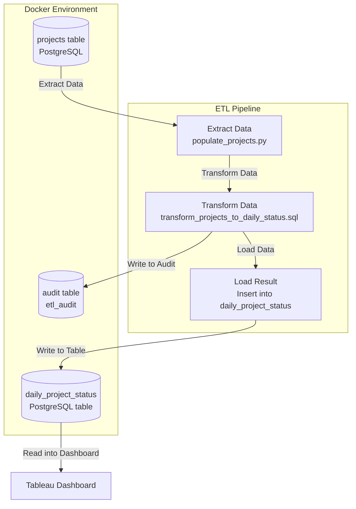

# Project Status Over Time ETL

This repository contains an ETL pipeline that transforms project milestone data into a daily project status table, suitable for time-series analytics in BI tools like Tableau. It leverages PostgreSQL for storage and transformation, Python for orchestration, and Docker for environment consistency.

## Overview

Typical project databases track only milestone dates like `initial_date`, `active_date`, and `end_date`. These do not provide visibility into the project's status on any given day.
This ETL generates a **daily-grain fact table** where each row reflects a project's status (`initial`, `active`, or `completed`) on a specific date. This structure enables precise trend analyses and timeline visualizations.

## Sample Data: `projects` Table

The table below shows representative rows from the `projects` table that reflect various milestone availability scenarios:

| project_id | store_date  | initial_date | active_date | end_date    | project_name    | owner    | region   | budget   |
|------------|-------------|--------------|-------------|-------------|------------------|----------|----------|----------|
| 001        | 2024-01-01  | 2024-01-01   | 2024-01-05  | 2024-02-01  | Apollo Expansion | Ops      | NA       | 100000   |
| 002        | 2024-01-10  | 2024-01-10   | 2024-01-15  | *(null)*    | Gemini Launch    | Finance  | EU       | 150000   |
| 003        | 2024-02-01  | 2024-02-01   | *(null)*    | *(null)*    | Orion Upgrade    | IT       | APAC     | 80000    |
| 004        | 2024-03-01  | *(null)*     | *(null)*    | *(null)*    | Nova Initiative  | R&D      | Global   | 120000   |

These samples are useful for testing and validating the logic implemented in the transformation SQL.

## Output Schema (`daily_project_status` table)

| Column       | Type    | Description                              |
|--------------|---------|------------------------------------------|
| project_id   | UUID    | Project identifier                       |
| project_date | DATE    | Specific date between start and end      |
| status       | TEXT    | One of: `initial`, `active`, `completed` |

## Transformation Logic - SQL Backbone: From Milestones to Daily Status

To generate a daily project status table from milestone data, I implemented a 3-step SQL transformation process that ensures data completeness, accuracy, and resilience when milestone fields are missing.

### Step 1: Calculate Average Duration (from Completed Projects)
To fill cases where there is no end date I will be estimating the duration of ongoing or incomplete projects by
calculating the average duration in days across all projects that have both `initial_date` and `end_date`. 

```sql
WITH avg_duration AS (
    SELECT 
        ROUND(AVG(end_date - initial_date))::INT AS avg_days
    FROM projects
    WHERE end_date IS NOT NULL
      AND initial_date IS NOT NULL
)
```

### Step 2: Determine Start and End Dates per Project
Since the date values are not always filled, I calculate a reliable `start_date` and `end_date` for each project:
- `start_date` is the earliest of: `initial_date`, `active_date`, or `store_date`.
- `end_date` is:
  - The real `end_date` (if available)
  - When there is no end_date latest milestone + average duration + 15-day buffer

```sql
expanded_projects AS (
    SELECT
        p.project_id,
        LEAST(p.initial_date, p.active_date, p.store_date) AS start_date,
        COALESCE(
            p.end_date,
            GREATEST(p.initial_date, p.active_date, p.store_date) + (a.avg_days + 15)
        ) AS estimated_end_date,
        p.initial_date,
        p.active_date,
        p.end_date
    FROM projects p
    CROSS JOIN avg_duration a
)
```

### Step 3: Expand into Daily Rows and Assign Status
In order to expand each project into daily rows I will be using `generate_series` to generate a date backbone and assign a project status (`initial`, `active`, `completed`) based on the milestone dates.

```sql
INSERT INTO daily_project_status (project_id, project_date, status)
SELECT
    ep.project_id,
    gs.day::date AS project_date,
    CASE
        WHEN ep.active_date IS NOT NULL AND gs.day < ep.active_date THEN 'initial'
        WHEN ep.active_date IS NOT NULL AND gs.day >= ep.active_date 
             AND gs.day < COALESCE(ep.end_date, ep.estimated_end_date) THEN 'active'
        WHEN ep.end_date IS NOT NULL AND gs.day = ep.end_date THEN 'completed'
        ELSE 'initial'
    END AS status
FROM expanded_projects ep
JOIN LATERAL generate_series(
    ep.start_date,
    COALESCE(ep.end_date, ep.estimated_end_date),
    interval '1 day'
) AS gs(day) ON TRUE;
```

This approach ensures:
- Daily visibility for each project
- Logical fallback when dates are missing
- Clean status transitions for time-series dashboards

### Interpretation Examples
Based on the transformation logic above, here's how the logic applies to the sample data:

- **Row 1:** Fully completed project → uses real `end_date`
- **Row 2:** Project with no `end_date` yet → uses estimated end
- **Row 3:** Only `initial_date` is known → uses fallback logic
- **Row 4:** No milestone dates → uses `store_date` for estimation

## ETL Architecture



## Live Tableau Dashboard

[Click here to view the interactive dashboard](https://public.tableau.com/app/profile/yonatan3121/viz/project-status-etl/Dashboard?publish=yes)
_Note: This link opens in the same tab. Right-click and choose "Open in new tab" for best experience._    