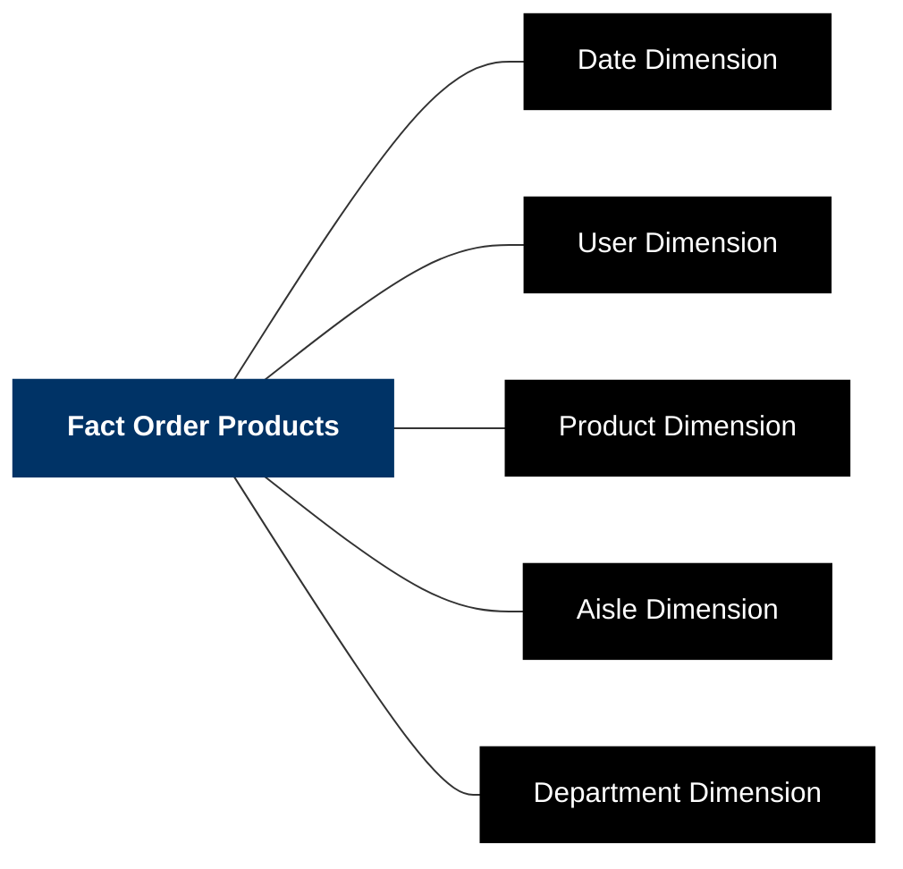

# Spark Star Schema Pipeline

## Overview
This project demonstrates a real-world data engineering pipeline using PySpark, a star schema data model, and Google Cloud Storage (GCS) as a data lake. The pipeline uses the Instacart Market Basket Analysis dataset from Kaggle, synthesizes a realistic date dimension, enriches all dimensions and the fact table, and stores the results as Parquet files in GCS.

## Tech Stack
- **PySpark**: Distributed ETL and data modeling
- **Google Cloud Storage (GCS)**: Data lake (free tier)
- **Python 3.9**, **Java 17**
- **Parquet**: Columnar storage format
- **Service Account Auth**: Secure cloud access

## Data Source
- **Instacart Market Basket Analysis** ([Kaggle link](https://www.kaggle.com/datasets/psparks/instacart-market-basket-analysis))- it contains millions of real grocery orders, products, aisles, departments, and users

## Key Features
- **Cloud-native:** Writes analytics-ready Parquet files to Google Cloud Storage
- **Scalable:** Handles millions of records with Spark
- **Big Data Modeling:** Star schema, partitioned data

## Project Structure
```
spark-star-schema-project/
  scripts/           # Python scripts for ETL, enrichment, date synthesis, etc.
  notebooks/         # Jupyter notebooks for exploration and analysis
  README.md
  requirements.txt
  .gitignore
  # The following are ignored by git:
  # datalake/        # Raw and processed data (see .gitignore)
  # notebooks/artifacts/ # Notebook-generated artifacts (see .gitignore)
```

## Scripts & Components

- **scripts/synthesize_date_dimension.py**  
  Synthesizes a realistic date dimension table from Instacart order data, assigning order dates and generating date attributes (year, month, weekday, etc.).

- **scripts/enrich_dimensions_and_fact.py**  
  Enriches all dimension tables (product, aisle, department, user, date) and the fact table. Adds synthetic features (e.g., unit price, sales amount), aggregates, and joins, outputting processed CSVs for ETL.

- **scripts/spark_etl_to_gcs.py**  
  Main ETL pipeline. Reads processed CSVs, validates schemas, transforms data into a star schema, and writes each table as Parquet files to Google Cloud Storage using PySpark.

- **jars/gcs-connector-hadoop3-latest.jar**  
  Google Cloud Storage connector JAR for Hadoop/Spark. Enables PySpark to read from and write to GCS buckets securely and efficiently.

## Architecture & Data Flow


## Star Schema Model


## Why Spark, Star Schema, and a Data Lake?

The Instacart dataset consists of several large CSV files, including:
- `order_products.csv`: **600 MB after concatenation**
- `orders.csv`: **150 MB after adding dates**

With over half a gigabyte in a single file and millions of records, traditional pandas or single-machine workflows become slow and memory-intensive. Using **PySpark** enables distributed processing, allowing the pipeline to efficiently handle, transform, and join these large datasets. 

Storing the processed data in a **star schema** (fact and dimension tables) makes analytics fast and flexible, supporting a wide range of business intelligence queries. Saving the results as **Parquet files** in a cloud data lake (GCS) provides scalable, cost-effective storage and enables downstream analytics with Spark, BigQuery, or other tools.

## Analysis & Performance Optimization
[View the analysis notebook with example queries and visualizations.](notebooks/star_schema_analysis.ipynb)

The analysis notebook demonstrates how the star schema enables efficient, expressive analytics.

To further optimize performance on large joins and aggregations, I used **Spark's `repartition()`** method before groupBy operations. This repartitioning step ensures that Spark distributes the data more evenly across partitions, reducing data shuffling and improving parallelism. As a result, queries run significantly faster, even on a single machine or limited cloud resources.

## Quick Start

### Prerequisites
- Python 3.9
- Java 17 (OpenJDK)
- Google Cloud account & GCS bucket
- Service account key with Storage Object Admin role

### Setup & Run
```bash
# Clone repo and enter project directory
git clone <repo-url>
cd spark-star-schema-project

# Create and activate Python virtual environment
python3.9 -m venv venv
source venv/bin/activate
pip install -r requirements.txt

# Install Java 17 (macOS)
brew install openjdk@17
echo 'export PATH="/opt/homebrew/opt/openjdk@17/bin:$PATH"' >> ~/.zshrc
echo 'export JAVA_HOME="/opt/homebrew/opt/openjdk@17"' >> ~/.zshrc
source ~/.zshrc

# Set up GCS service account key
export GOOGLE_APPLICATION_CREDENTIALS="$HOME/.gcp/spark-etl-key.json"

# Run the ETL pipeline
python scripts/spark_etl_to_gcs.py
```