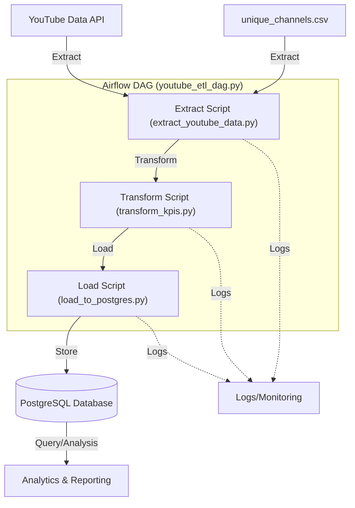
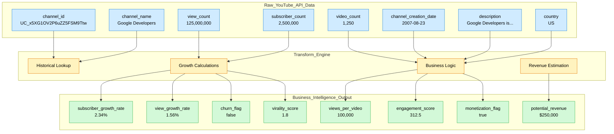

# YouTube Channel Analytics Pipeline

This project is a product-oriented, end-to-end ETL pipeline designed for SaaS-style KPI monitoring using YouTube Data API v3. It extracts, transforms, and loads on a daily basis YouTube channels data, tracks channel performance over time, and stores the results in a local PostgreSQL database using Airflow for orchestration.

## Project Goals
- Simulate a SaaS analytics product for YouTube channels
- Showcase my abilities as a data engineer

## Tech Stack
- **Airflow**: DAG scheduling and orchestration (via Docker)
- **PostgreSQL**: Data warehouse (running in a container)
- **YouTube Data API v3**: Data source
- **Python 3.9**: ETL logic
- **Docker Compose**: Multi-service setup

## ETL Pipeline Flow Diagram



## Folder Structure

```
├── dags/                  # Airflow DAGs
│   └── youtube_etl_dag.py # Main ETL DAG
├── scripts/               # ETL logic: extract, transform, load
│   ├── extract_youtube_data.py  # YouTube API data extraction
│   ├── load_to_postgres.py      # Database loading
│   ├── batch_etl.py             # Batch processing for multiple channels
│   ├── transform_kpis.py        # KPI transformation logic
│   └── youtube_etl.py           # Orchestrates ETL steps
├── data/                  # Static input and preprocessing scripts
│   ├── unique_channels.csv      # List of YouTube channels to track
│   └── data_preprocess.py       # Script for preparing/filtering channel lists
├── tests/                 # Unit tests for ETL scripts
├── docker-compose.yml     # Multi-container config
├── requirements.txt       # Python dependencies
├── README.md              # Project documentation
├── .gitignore             # Git ignore rules
└── .env                   # API keys and secrets (not tracked in git)
```

## Data Sources

- **YouTube Data API v3**:  
  The YouTube Data API v3 is an official Google API that allows applications to retrieve and manage YouTube resources such as videos, channels, and playlists. In this project, it is used to programmatically extract up-to-date channel statistics and metadata for the channels listed in `unique_channels.csv`. This enables automated, scalable, and reliable data collection directly from YouTube.
  
  *How to get an API key?*  
  To generate a YouTube Data API key, visit the [Google Cloud Console YouTube API page](https://console.cloud.google.com/marketplace/product/google/youtube.googleapis.com?q=search&referrer=search&inv=1&invt=Ab1rsQ&project=youtube-kpi-tracker-464411), enable the API for your project, and create an API key. Use this key in your `.env` file as `YOUTUBE_API_KEY`.

- **data/unique_channels.csv**:  
  This file contains a curated list of YouTube channel IDs and names to be tracked by the pipeline. It serves as the input for the ETL process, allowing the pipeline to know which channels to extract data for each run.
(Can be found on Kaggle- https://www.kaggle.com/datasets/rsrishav/youtube-trending-video-dataset?resource=download&select=US_youtube_trending_data.csv)
  
  *Why?*  
  Using a static CSV makes the pipeline reproducible and easy to demo, and allows users to customize which channels are analyzed by editing this file.

- **data/data_preprocess.py**:  
  This script is used to preprocess, filter, or generate the `unique_channels.csv` file. It can be used to select a subset of channels, clean the input data, or transform raw channel lists into the format required by the ETL pipeline.

## Transform Stage: Business Intelligence Engine

The transform stage is where raw YouTube API data becomes actionable business intelligence. This layer calculates business-relevant KPIs that would be valuable for a SaaS analytics platform.

### Data Transformation: Before vs After



### Business Impact

The transform layer enables:
- **Churn Prediction**: Early warning system for declining channels
- **Revenue Forecasting**: Monetization potential assessment
- **Content Strategy**: Performance optimization insights
- **Market Intelligence**: Competitive analysis capabilities

## How to Run

### 1. Set up Environment
Follow these steps to set up and run the project locally:

1. **Clone the repository**
   ```sh
   git clone https://github.com/YonatanHanasav/youtube-analytics-project.git
   cd youtube-analytics-project
   ```

2. **Create a virtual environment**
   ```sh
   python -m venv venv
   # Activate the virtual environment:
   # On macOS/Linux:
   source venv/bin/activate
   # On Windows:
   venv\Scripts\activate
   ```

3. **Install dependencies**
   ```sh
   pip install -r requirements.txt
   ```

4. **Set up environment variables**
   Create a `.env` file in the project root (not included in the repo for security), use this template:

   ```
   YOUTUBE_API_KEY=your_youtube_api_key_here
   DB_NAME=youtube_db
   DB_USER=airflow
   DB_PASSWORD=airflow
   DB_HOST=postgres
   DB_PORT=5432
   BATCH_SIZE=50
   MAX_CHANNELS=1000
   ```

### 2. Install Docker Desktop
Ensure Docker Desktop is installed and running on your machine.

### 3. Start the Pipeline
```bash
# Start all services
docker compose up -d
# Wait for services to initialize (about 30 seconds)
```

### 4. Access Airflow
- **URL**: http://localhost:8080
- **Username**: `admin`
- **Password**: `admin`

### 5. Run the ETL Pipeline
1. Go to the Airflow web interface
2. Find the `youtube_kpi_daily_batch` DAG
3. Click the "Play" button to trigger a manual run
4. Monitor the execution in the Airflow UI

## Configuration

### API Quota Management
- **Default quota**: 10,000 units/day
- **Current batch size**: The pipeline processes channels in batches (configurable via the BATCH_SIZE variable) rather than all at once. Batching is used to efficiently manage API quota limits, and ensure that the daily quota is not exceeded. By processing a set number of channels per batch, the pipeline can maximize throughput while minimizing the risk of failed requests due to quota exhaustion. This approach also allows for better error handling and retry logic, as failures in one batch do not affect the processing of others.
- **Quota usage**: ~2 units per channel per day (channel endpoint only)

## Features

### Implemented
- **Daily channel KPI tracking** with time-series analytics
- **Rich business KPIs**: growth, churn, engagement, monetization, virality
- **Batch processing** of up to 500 channels per run
- **Robust error handling** - each channel processed independently
- **Automatic table creation** with proper schema
- **Historical data preservation** for trend analysis
- **SaaS/product-analytics-ready** data model

## Testing

To run the test suite, ensure dependencies are installed and run:
```bash
pytest
```
